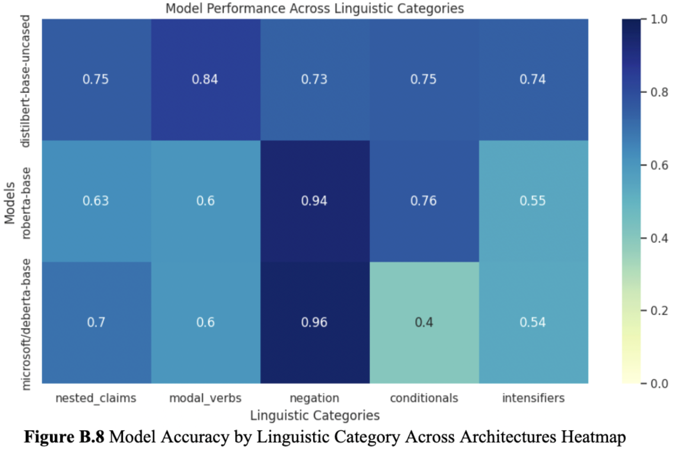

# 📚 TruthLens: Linguistically-Informed Fact Verification with Transformer Models

**TruthLens** is a lightweight, explainable NLP tool for verifying factual claims using transformer models fine-tuned on the FEVER and LIAR datasets. It goes beyond classification accuracy to explore how well models interpret **linguistic nuances** such as modals, negation, intensifiers, and conditionals — subtle features that influence truth perception in language.

> 🧠 Built for explainability, sensitivity, and cross-domain robustness.

---

## 🚀 Live Demo

Try the app on Hugging Face Spaces:  
👉 https://huggingface.co/spaces/malorieiovino/TruthLens

---

## 🧠 Models

Each model is fine-tuned, optimized, and hosted for use in the Streamlit app:

- 🤖 [`distilbert_fever`](https://huggingface.co/malorieiovino/distilbert_fever)  
- 🤖 [`roberta_fever`](https://huggingface.co/malorieiovino/roberta_fever)  
- 🤖 [`deberta_liar`](https://huggingface.co/malorieiovino/deberta_liar)  

These models are pruned (~30% parameter sparsity) for efficient inference without loss in classification performance.

---

## ✨ Key Features

- 🔎 **Fact Verification Pipeline** using DistilBERT, RoBERTa, and DeBERTa
- 🔬 **Linguistic Analysis** on claims with modals, conditionals, negation, intensifiers, and nested logic
- 📉 **LIME Explainability** to show which tokens influence predictions most
- ⚖️ **Calibration Evaluation** for prediction confidence vs correctness
- ⚙️ **Streamlit App** deployed on Hugging Face for real-time interaction

---

## 📊 Linguistic Performance Heatmap

**Figure B.8**: Model accuracy by linguistic category across DistilBERT, RoBERTa, and DeBERTa.
---

| Linguistic Feature | DistilBERT | RoBERTa | DeBERTa |
|--------------------|------------|---------|---------|
| Modals             | **0.84**   | 0.60    | 0.60    |
| Negation           | 0.73       | 0.94    | **0.96**|
| Conditionals       | 0.75       | **0.76**| 0.40    |
| Intensifiers       | **0.74**   | 0.55    | 0.54    |
| Nested Claims      | 0.75       | 0.63    | 0.70    |

---

## 🧪 Methodology Overview

- **Datasets**: [FEVER](https://fever.ai/) for benchmark fact verification; [LIAR](https://www.cs.ucsb.edu/~william/data/liar_dataset.zip) for real-world political claims
- **Baseline**: TF-IDF + Logistic Regression model for interpretability
- **Transformers**: Hugging Face fine-tuning with early stopping, learning rate tuning, and dropout
- **Linguistic Subsets**: Rule-based annotation using NLTK for filtered claim analysis
- **Explainability**: [LIME](https://github.com/marcotcr/lime) used for token-level contribution mapping

---

## 🧰 Tech Stack

- Python · PyTorch · Hugging Face Transformers
- Streamlit · LIME · NLTK · Scikit-learn · Matplotlib/Seaborn

---

## 📁 Project Structure

- `app/` — Streamlit app and UI logic (e.g., `app.py`, LIME, model utils)
- `data/` — Processed or sample data (e.g., FEVER, LIAR subsets)
- `notebooks/` — Development and evaluation notebooks
- `heatmap.png` — Linguistic performance heatmap (Figure B.8)
- `requirements.txt` — Python package dependencies
- `README.md` — Project overview and documentation
- `.DS_Store` — System file (safe to delete or add to `.gitignore`)
---

## 🧠 Academic Context

This project was developed as part of a final NLP coursework submission for the MSc in Computational Linguistics at Goldsmiths, University of London
---

## 📘 References

- Thorne et al. (2018). [FEVER Dataset](https://fever.ai/)
- Wang (2017). [LIAR Dataset](https://aclanthology.org/P17-2067/)
- Sanh et al. (2019). [DistilBERT](https://arxiv.org/abs/1910.01108)
- Liu et al. (2019). [RoBERTa](https://arxiv.org/abs/1907.11692)
- He et al. (2021). [DeBERTa](https://openreview.net/forum?id=XPZIaotutsD)
- Ribeiro et al. (2016). [LIME](https://arxiv.org/abs/1602.04938)

(Full reference list available in the project write-up.)

---

## 🙌 Acknowledgements

Developed by **Malorie Iovino**  
MSc Computational Linguistics · 2025

---

## 📜 License

MIT License
